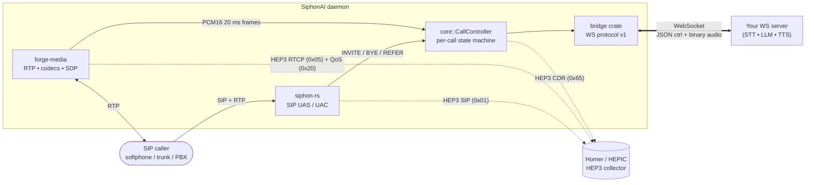

# SiphonAI

A SIP-to-WebSocket media bridge written in Rust.

SiphonAI accepts inbound SIP calls (as a trunk endpoint or as a registered
phone on a PBX), streams the call's audio over a WebSocket to a developer-
supplied server, and plays audio received back over that WebSocket into the
call. **It does not contain any AI code** — that is the WebSocket server's job.

## How it fits together



The WebSocket server runs the AI — STT, LLM, TTS, whatever fits the
use case. SiphonAI is the bridge: SIP signaling, RTP media, codec
handling, jitter, barge-in, DTMF, hold, transfer. See
[`docs/PROTOCOL.md`](docs/PROTOCOL.md) for the contract.

## Status

Pre-alpha. See `docs/DEV_PLAN.md` for the 7-week sprint plan.

## Quickstart (Docker)

The fastest way to see SiphonAI work end-to-end is the local demo
stack — a containerized daemon talking to the reference Python echo
WebSocket server.

```sh
# Build + run the daemon + echo-ws in the background.
docker compose -f docker/compose.yaml up -d

# Drive a call from your host. Any softphone pointed at
# 127.0.0.1:5070 works; this one uses SIPp.
sipp -sf test-harness/sipp-scenarios/basic_call_then_bye.xml \
     -m 1 -p 5080 -s 1000 127.0.0.1:5070

# Watch the call land:
docker compose -f docker/compose.yaml logs -f siphon-ai echo-ws
```

The echo server replays every audio frame back into the call, so if
you use a softphone you'll hear yourself.

The compose file mounts `docker/local-dev.toml` over the image's
default config. Edit it (or supply your own with `-v
./my.toml:/app/config.toml:ro`) and `docker compose restart
siphon-ai` to apply.

Prometheus metrics live on `http://127.0.0.1:9091/metrics`;
`/health` and `/ready` are next to them.

For the full HEP/Homer end-to-end demo (SIP + RTCP + CDRs
correlated in one call view), see
[`examples/homer-stack/`](examples/homer-stack/).

## Layout

| Path | Purpose |
|---|---|
| `crates/core/`        | `CallController`, state machine, glue |
| `crates/bridge/`      | WS client + protocol types + audio bridging |
| `crates/sip-glue/`    | Adapter from `siphon-rs` events to core |
| `crates/media-glue/`  | Adapter from `forge-engine` to core (the audio tap) |
| `crates/routes/`      | Route matching engine (TOML dialplan) |
| `crates/cdr/`         | CDR generation (JSON), file sink, webhook sink |
| `crates/webhooks/`    | Out-of-band lifecycle webhooks |
| `crates/config/`      | TOML config + validation + reload |
| `crates/telemetry/`   | tracing + metrics + HEP wiring + admin endpoints |
| `bins/siphon-ai/`     | The daemon binary |
| `examples/`           | Reference WS servers and the local Homer stack |
| `test-harness/`       | SIPp scenarios, load tooling, HEP collector stub |
| `docs/`               | Protocol, config, dialplan, HEP, deployment |

## Building

```sh
cargo build --workspace
cargo clippy --workspace --all-targets -- -D warnings
cargo test --workspace
```

## Reading order for contributors

1. `CLAUDE.md` — operating instructions (read first; re-check before
   non-trivial changes).
2. `docs/DEV_PLAN.md` — what we're building and why.
3. `docs/PROTOCOL.md` — the WebSocket bridge protocol contract.

## Upstream dependencies

SiphonAI is glue. The heavy lifting lives in three companion repos owned by
the same author:

- [`siphon-rs`](https://github.com/thevoiceguy/siphon-rs) — RFC 3261 SIP stack
- [`forge-media`](https://github.com/thevoiceguy/forge-media) — RTP/codecs/SDP/jitter/VAD
- [`hep-rs`](https://github.com/thevoiceguy/hep-rs) — HEP3 codec, transport, `HepSink` trait

## License

Dual-licensed under MIT or Apache-2.0, matching the upstream stack.
