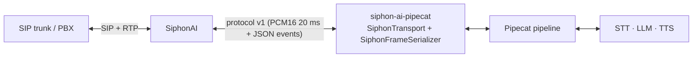

# Design: Pipecat connector (`siphon-ai-pipecat`)

> **Status: BUILT (2026-10-01)** — design and first implementation land in
> the same PR. Decisions flagged for review are marked **[decision]**. No
> daemon change and no protocol change: this connector is a *client* of
> protocol v1 and sits entirely on the WS-server side of the line.

## 1. Goal

Let a [Pipecat](https://www.pipecat.ai/) bot answer SiphonAI calls with
the same few lines it takes to answer Twilio or Telnyx calls:



SiphonAI stays AI-free (CLAUDE.md §4.1). Every provider call lives in the
Pipecat process; the connector only maps protocol v1 onto Pipecat frames.

## 2. What the obvious approach gets wrong

The first idea is Pipecat's stock telephony recipe:
`FastAPIWebsocketTransport` + a custom `FrameSerializer`, the way
`TwilioFrameSerializer` works. Checked against Pipecat 1.12.0 source, that
recipe breaks against SiphonAI in two ways.

**1. Pipecat streams at 2× real time, and SiphonAI drops anything beyond 200 ms.**
`FastAPIWebsocketOutputTransport` sleeps `chunk_duration / 2` per chunk
(`_send_interval = (audio_chunk_size / sample_rate) / 2`). Twilio, Telnyx
and Vonage buffer without limit, so for them this just keeps the queue
full. SiphonAI does not: it holds **200 ms** ahead of playout and drops
the oldest frames beyond that (PROTOCOL.md §5.5, deliberately, so barge-in
stays snappy). A 5 s TTS reply sent at 2× would play its last ~2.5 s with
the start missing. `fixed_audio_packet_size` fixes the frame *size*, not
the *rate*.

**2. Pipecat's "bot stopped speaking" would fire too early.** The output
transport's speaking state follows what it has *sent*. At 2× real time,
`BotStoppedSpeakingFrame` fires while the caller is still hearing the reply.
Interruption strategies and user-idle timers then see the wrong state.

**3. Lifecycle mismatches.** These apply whichever transport is used:

| Concern | SiphonAI rule | Consequence |
|---|---|---|
| Start deadline | First audio frame within `server_start_deadline_secs` (5 s) of `start`, or `server_too_slow` teardown (§3.1) | A listen-first bot, or a cold LLM+TTS greeting, gets killed |
| Ending a call | Only `hangup` ends it; with `ws_reconnect_enabled` a bare close is a *drop* and gets redialed (§5.7) | Pipeline shutdown must send `hangup`, not just close |
| Answer timing | 200 OK is sent before the WS opens (§4.3) | The bot cannot reject a call; screening belongs in routes/trunk/admission |
| Barge-in policy | Daemon may already flush playout on VAD (`auto_clear`) | Two components deciding interruptions disagree |

So the connector is a **transport plus a serializer**, not just a serializer.

## 3. Shape

A Python package, `siphon-ai-pipecat`, at **`sdks/pipecat/`** **[decision]**
(next to the protocol SDKs it builds on; an `examples/` folder is for
runnable servers, not importable libraries). It depends on:

- `pipecat-ai[websocket] >=1.12,<2`: FastAPI/Starlette WebSocket support,
  which is what Pipecat telephony deployments (and Pipecat Cloud) already
  use.
- `siphon-ai-server` (`sdks/python`): its typed event parser. The connector
  reuses `parse_event` / `Start` and does not re-derive the wire types, so
  the schema-drift tests that guard the SDK guard this package too
  **[decision]**.

Three public pieces:

| Piece | Responsibility |
|---|---|
| `SiphonFrameSerializer` | Pure protocol mapping, frame ↔ wire. No timing, no I/O. Unit-testable in isolation. |
| `SiphonTransport` | A Pipecat `BaseTransport` over a FastAPI `WebSocket`. It owns `start` parsing, real-time pacing, start-deadline priming, `hangup`-on-end, mark-drained shutdown, pause-mode arbitration and event dispatch. |
| `SiphonEventFrame`, `siphon_command()` | In-pipeline access to every protocol event, and an ordered way to send any §4 command. |

Usage:

```python
@app.websocket("/ws")
async def ws(websocket: WebSocket):
    transport = await SiphonTransport.accept(websocket)   # handshake + `start`
    # transport.start: typed Start — from/to/direction/sip headers/reconnected…
    pipeline = Pipeline([transport.input(), stt, user_agg, llm, tts,
                         transport.output(), assistant_agg])
    worker = PipelineWorker(pipeline, params=transport.pipeline_params())

    @transport.event_handler("on_call_stopped")
    async def _(transport, reason):
        await worker.cancel()

    runner = WorkerRunner(handle_sigint=False)
    await runner.add_workers(worker)
    await runner.run()
```

## 4. Mapping

### 4.1 Audio

- **Rates.** `SiphonTransport` pins the transport's `audio_in_sample_rate`
  and `audio_out_sample_rate` to `start.audio.sample_rate` (8 or 16 kHz).
  STT services resample their own input. TTS output at 24 kHz or more is
  resampled by `BaseOutputTransport`, which also chunks it, and
  `audio_out_10ms_chunks = 2` makes each chunk exactly one 20 ms protocol
  frame. On `TTSStoppedFrame` Pipecat zero-pads the trailing partial chunk,
  so an utterance never leaves a fragment to prepend to the next one.
  `transport.pipeline_params()` sets only the pipeline's **input** rate to
  the call's. The output rate stays at Pipecat's default **[corrected
  2026-10-01]**. The first version pinned it to the call's rate as well, on
  the theory that TTS would synthesize there. The live provider test (§6)
  showed that a fixed-rate service such as OpenAI TTS (24 kHz only) instead
  *labels* its 24 kHz audio with the pipeline rate, so a 2.8 s greeting
  played as 8.4 s. Correctly labelled audio at any rate is resampled by the
  transport, which is pinned to the call's rate.
- **Framing guard.** The serializer still resamples if a frame arrives at
  another rate, and the output transport re-frames into exact 20 ms frames
  regardless. A wrong-size frame is impossible by construction, never just
  unlikely.
- **Pacing.** The output transport paces against a monotonic clock, one
  frame per 20 ms, and allows a **lead** of `playout_lead_ms` (default
  60 ms, validated `< 200`) to absorb event-loop jitter. This replaces
  Pipecat's 2× sleep. Because `write_audio_frame` blocks at real time,
  Pipecat's bot-speaking state tracks what the caller hears, within the
  lead. After an idle gap the clock re-anchors instead of bursting to catch
  up, the same rule as the Python SDK's `AudioSender`.
- **Inbound.** Each 20 ms binary frame becomes an `InputAudioRawFrame` at
  the call's rate.

### 4.2 Interruptions (barge-in)

Pipecat decides interruptions. The connector acts on that decision. The
behaviour depends on `start.barge_in_mode`:

| Mode | Behaviour | Status |
|---|---|---|
| `notify_only` | `InterruptionFrame` → `clear`, and the local re-framer drops its partial frame. Only Pipecat's turn strategy can cut the bot. | **Recommended.** One brain decides. |
| `pause` | The daemon ducks playout within one frame on caller speech (`decision_pending`) and the connector arbitrates: if Pipecat raises an `InterruptionFrame` before the deadline, `clear` is sent (≡ `barge_in_confirm`, §4.1); if not, `barge_in_reject` is sent `pause_decision_margin_ms` (default 100 ms) before `decision_deadline_ms`, and the bot resumes where it stopped. | **Supported, with configuration [revised 2026-10-02 after the PSTN test, §6]:** (a) the connector **holds its outbound audio while the arbitration is pending** (the paced writer blocks, back-pressuring Pipecat), and on release **shifts its pacing schedule by the daemon's exact pause** (`barge_in_resolved.offset_ms − speech_started.offset_ms`, plus 40 ms bias) instead of re-anchoring. Frames sent ahead before the pause are still unplayed (the reject re-queues them); a fresh lead on top grew the retained tail with every pause (5 → 12 → 15 frames) until the window evicted audio. Under-shifting compounds; over-shifting self-corrects, which is why the bias is positive. The first version streamed into the pause on the theory that the daemon would queue it behind the tail, but a reject then re-queues that backlog and the daemon's 200 ms window evicts the real-time audio that follows: 158 frames lost over 5 rejects on a live call (#620). (b) Pipecat's default turn-start strategy interrupts on any voice Silero accepts, coughs included, so it never produces a reject; use `MinWordsUserTurnStartStrategy` (the example's `BOT_INTERRUPT_MIN_WORDS=2`). (c) That waits for STT words, so raise the route's `decision_ms` (1200 ms tested; Pipecat's VAD alone took 160–433 ms, past the 400 ms reject point of the 500 ms default). |
| `auto_clear` | `clear` is still sent on `InterruptionFrame`, but the daemon has already flushed on its own VAD, including for speech Pipecat's strategy would have ignored. Pipecat then believes the bot is still talking. | Works, with a startup warning. |
| absent (pre-0.32 daemon) | Treated as `auto_clear`. | Warning. |

The daemon's `speech_started` / `speech_stopped` are **not** converted into
Pipecat's `UserStartedSpeakingFrame`/VAD frames **[decision]**. Pipecat
runs its own VAD and turn analyser on the audio, and two VADs feeding the
same aggregator would race. The events still reach the app as
`SiphonEventFrame`s (§4.4), including `bot_playing: true` interruptions.

### 4.3 Lifecycle

| Moment | Connector behaviour |
|---|---|
| Upgrade | `SiphonTransport.accept()` accepts with subprotocol `siphon-ai.v1`, optionally checks `Authorization: Bearer` against `auth_token` (matching `[bridge].auth_bearer`; mismatch → close 1008), then reads `start` (10 s timeout). If `start` is wrong or missing, the socket is closed with 1002, or 1003 for a non-v1 `version` (§5.4). |
| Pipeline started | One 20 ms silence frame is sent when the output transport starts (`prime_start_deadline`, default on) **[decision]**. That satisfies the start deadline once the pipeline is genuinely running, which is the thing the deadline exists to detect, and it lets listen-first bots and slow cold-start greetings work. |
| `EndFrame` (bot ends the call, e.g. `EndWorkerFrame` after "goodbye") | Pipecat drains queued audio. The connector then sends `mark {name: "pipecat-end"}` and waits for the echo, which comes back once the caller has *heard* the last frame (bounded by `end_drain_timeout_secs`, default 2 s). Then it sends `hangup`. This replaces Pipecat's blind 2 s `audio_out_end_silence_secs` tail, which is set to 0. |
| `CancelFrame` | `hangup` immediately, with no drain. |
| End while a `transfer`/`park` is pending | No `hangup`: its BYE would kill the dialog under the REFER. The transport waits (up to 10 s) for the daemon's `stop` (`transfer`/`park`). If the daemon reports `transfer_failed`/`park_failed` instead, the call is still live, so the transport hangs up as usual. |
| `stop` from daemon | `on_call_stopped(transport, reason)` fires and no `hangup` is sent afterwards (the call is already over). The daemon closes the socket, and `on_client_disconnected` fires as usual. |
| Socket dies without `stop` | `on_client_disconnected` fires. If the daemon has reconnect enabled, it redials. The new socket arrives with `start.reconnected = true` on a fresh pipeline (§5.7). Conversation memory across a redial is the app's job, keyed by `transport.start.call_id`. |
| `auto_hang_up=False` | Disables the `hangup` on End/Cancel, for bots that `park` or `transfer` and then simply stop. |

### 4.4 Events and commands

- **DTMF in:** `dtmf` → `InputDTMFFrame` (Pipecat's native type, used by
  `IVRNavigator`, DTMF aggregators, etc.).
- **DTMF out:** `OutputDTMFFrame` / `OutputDTMFUrgentFrame` → `send_dtmf`
  (native RFC 2833 via the daemon, never in-band tones).
- **Everything else** (`speech_*`, `hold`/`resume`, `mark`,
  `silence_detected`, `dead_air_detected`, `rtp_stats`, `recording_*`,
  `conference_*`, `held`/`resumed`, `barge_in_resolved`, `playout_*`,
  `error`, unknown types): pushed downstream as
  `SiphonEventFrame(event=<typed SDK event>)`, a `SystemFrame` that custom
  processors can react to, and also delivered to the transport's
  `on_siphon_event(transport, event)` handler. Unknown types arrive as the
  SDK's `UnknownEvent` and never crash the call (§5.4).
- **Commands:** `siphon_command("transfer", target="sip:…")` builds an
  `OutputTransportMessageFrame`. Being a `DataFrame`, it is sent **in order
  after the audio queued before it**, so "say 'transferring you now', then
  transfer" works by pushing frames in sequence. `urgent=True` builds the
  `OutputTransportMessageUrgentFrame` variant (sent immediately). The
  serializer fills `call_id`. The transport also exposes direct
  coroutines (`await transport.hangup()`, `transfer()`, `hold()`, …) for
  LLM function-call handlers.

## 5. Explicit non-goals (v1 of the connector)

- **Pre-answer screening.** Not possible over protocol v1 (§4.3; #376).
- **Driving Pipecat's VAD from the daemon's VAD.** See §4.2.
- **An upstream Pipecat PR.** A `SiphonFrameSerializer` in
  `pipecat/serializers/` would be the natural long-term home, but it is only
  correct with real-time pacing, which `FastAPIWebsocketTransport` cannot do
  today. The follow-up is to propose a pacing knob upstream first. **Ask
  before opening.**
- **Daemon changes.** None needed.

## 6. Verification

1. **Unit:** serializer mapping in both directions, every command validated
   against `schemas/siphon-ai.v1.json` `$defs/BridgeIn`.
2. **In-process transport tests:** a FastAPI app under uvicorn on a random
   port, with a `websockets` client playing the daemon. These assert
   handshake and `start` parsing, the start-deadline prime frame, exact
   frame sizes, real-time pacing, `clear` on interruption, mark-drained
   `hangup` on `EndFrame`, no `hangup` after `stop`, both pause-mode
   verdicts, and DTMF in and out.
3. **Conformance:** `examples/pipecat-bot-py --echo` (a Pipecat echo
   pipeline on the connector) runs the full bundled `siphon-ai-testkit`
   suite in CI next to the two SDK echo servers.
4. **Live smoke against the daemon** (2026-10-01; SIPp caller, daemon in
   `notify_only`, a Pipecat bot that queues 3 s of 24 kHz TTS audio in one
   burst and then ends the call):

   | Pacing | `siphon_ai_outbound_audio_frames_dropped_total` | Call length | End |
   |---|---|---|---|
   | This transport (real time, 60 ms lead) | **0** | 3,050 ms | drained `hangup` → `server_hangup` |
   | Pipecat stock (2×, emulated) | **65** (1.3 s of the 3 s reply) | 1,742 ms | `server_hangup` |

   The daemon logged its "streaming faster than realtime" warning only in
   the 2× run. This confirms the §2 premise on the real system rather than
   by reading the code.
5. **Live providers, LAN** (2026-10-01; Deepgram STT, OpenAI LLM + TTS,
   SIPp caller). Found that pinning the pipeline's *output* rate to the
   call's rate made OpenAI TTS, which is fixed at 24 kHz, play 3× slow
   (§4.1, corrected). After the fix, the greeting turn lasted 2.96–3.06 s
   for 2.85 s of speech.
6. **PSTN through Twilio Elastic SIP Trunking** (2026-10-01; a mobile phone
   calling a Twilio DID, routed to a Linode staging box running the
   released v0.54.0 `.deb`, `notify_only`, G.711 μ-law at 8 kHz):

   | Check | Result |
   |---|---|
   | Outbound audio dropped by the daemon | **0** frames over 2 calls |
   | Network | 0 % loss, 2 ms jitter, 66 ms RTT, MOS 4.41 |
   | Interruptions | 4 of 4 real interruptions cut the bot, **220–310 ms** after the daemon heard the caller; the connector's `clear` reached the daemon within ms of Pipecat's decision |
   | False interruptions | **0**. The daemon's energy VAD fired 9 times during bot speech (`barge_in_count 9`); the other 5 were breath or noise 20–45 dB below speech, uncorrelated with the bot's audio (not echo), and Silero correctly ignored them. Under `auto_clear` those 5 would each have cut the bot, which is the case for §4.2's recommendation in numbers |
   | `end_call` hangup | Goodbye played in full, then the `mark` echo, then `hangup`, with BYE about 80 ms after the last audio. CDR `server_hangup` |
   | Turn latency (Pipecat end of user turn → bot audio) | 1.3–3.0 s, median ≈ 2.4 s. Almost entirely provider time (LLM 0.5–1.4 s, OpenAI TTS first byte 0.8–1.8 s); no measurable connector overhead |

   **Pause mode** (`decision_ms = 1200`, `BOT_INTERRUPT_MIN_WORDS=2`): over
   PSTN, coughs, "mm-hmm" and 17 dog barks were all rejected (the bot
   resumed), and multi-word interruptions confirmed in 449 ms. Each rejected
   noise still paused the bot for about 1.1 s, because the daemon's energy
   VAD arms on any loud sound; pair pause mode with `[media].vad = "neural"`.
   The first connector version lost audio after rejects (158 and then 73
   frames on two calls). A scripted repro on the staging box (SIPp playing
   300 ms/700 ms bark bursts over a 25 s bot turn, daemon debug logging)
   traced it in three steps:

   | Connector behaviour | Dropped (12 s run) | Retained tail per pause |
   |---|---|---|
   | Streams into the pause | 73 (live call) | grows to the 15-frame cap |
   | Holds, re-anchors at release | 33 | 5 → 12 → 15 |
   | Holds, shifts by local estimate | 8–9 | 5 → 8 → 11 → 14 → 15 |
   | Holds, shifts by daemon's exact pause + 40 ms | **0** (also 0 on two 30 s / 15-pause runs) | 5 5 5 5 … |

   Real-time servers that stream into a pause lost audio on the daemon
   side too: #620, fixed in the daemon after 0.55.0. The connector keeps
   its hold anyway, because it also keeps Pipecat's "bot is speaking"
   state aligned with what the caller actually hears during a pause.

   The example's `end_call`/`transfer_call` tools now return results with
   `run_llm=False`. Without it, Pipecat re-ran the LLM on the tool result
   and the caller heard a second "Goodbye!".
